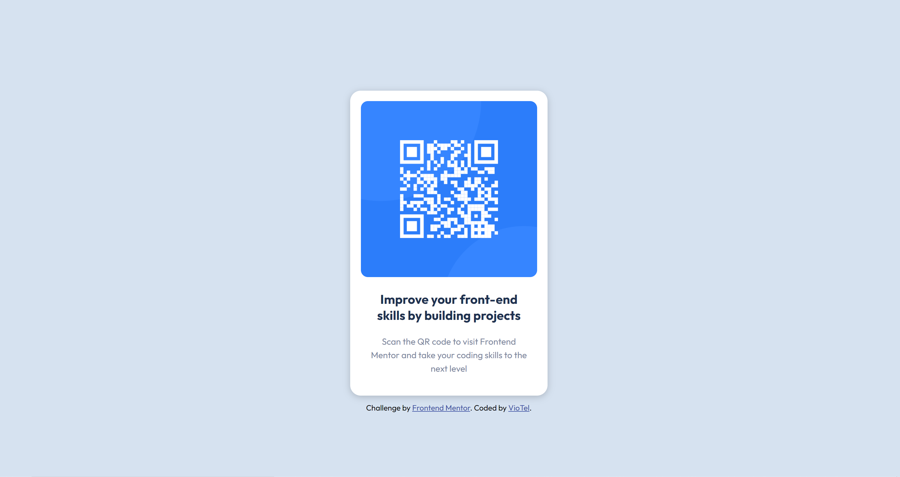

# Frontend Mentor - QR code component solution

This is a solution to the [QR code component challenge on Frontend Mentor](https://www.frontendmentor.io/challenges/qr-code-component-iux_sIO_H). Frontend Mentor challenges help you improve your coding skills by building realistic projects. 

## Table of contents

- [Overview](#overview)
  - [The challenge](#the-challenge)
  - [Screenshot](#screenshot)
  - [Links](#links)
- [My process](#my-process)
  - [Built with](#built-with)
  - [What I learned](#what-i-learned)
  - [Useful resources](#useful-resources)
- [Author](#author)

## Overview

### The challenge

Users should be able to:

- To build out QR code component and get it looking as close to the design as possible.

### Screenshot

### Links

- Solution URL: [https://github.com/viotel81/QR-Code.git]
- Live Site URL: [https://viotel81.github.io/QR-Code/]

## My process

### Built with

- Semantic HTML5 markup
- CSS custom properties
- Flexbox

### Useful resources

- [https://www.youtube.com/watch?v=JkeyKeK3V24&list=PLffpGLm21gYuhOIMWoZqQQx-QSXbNsNNE&index=12] - Traversy Media project 5 helped me structure the QR code card and apply some of the styling.

## Author

- Website - [VioTel](https://github.com/viotel81)
- Frontend Mentor - [@viotel81](https://www.frontendmentor.io/profile/viotel81)
